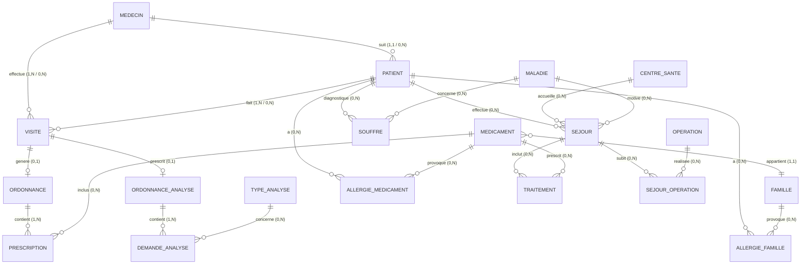

# MCD — Dossier Médical Informatisé

## Légende des cardinalités

| Symbole | Signification |
|---|---|
| `\|\|` | Exactement 1 |
| `o\|` | 0 ou 1 |
| `o{` | 0 ou plusieurs |
| `\|{` | 1 ou plusieurs |

## Associations principales

| Association | Entité 1 | Cardinalité | Entité 2 | Signification |
|---|---|---|---|---|
| suit | MEDECIN | 1,N / 1,1 | PATIENT | Un médecin suit plusieurs patients |
| effectue | MEDECIN | 1,N / 0,N | VISITE | Un médecin effectue plusieurs visites |
| fait | PATIENT | 1,N / 0,N | VISITE | Un patient fait plusieurs visites |
| genere | VISITE | 0,1 | ORDONNANCE | Une visite génère au plus une ordonnance |
| prescrit | VISITE | 0,1 | ORDONNANCE_ANALYSE | Une visite prescrit au plus une ordonnance d'analyses |
| contient | ORDONNANCE | 1,N / 0,N | MEDICAMENT | Une ordonnance contient plusieurs médicaments |
| appartient | MEDICAMENT | 1,1 / 0,N | FAMILLE | Un médicament appartient à une famille |
| allergique | PATIENT | 0,N / 0,N | MEDICAMENT | Un patient peut être allergique à plusieurs médicaments |
| souffre | PATIENT | 0,N / 0,N | MALADIE | Un patient peut souffrir de plusieurs maladies |
| effectue | PATIENT | 0,N / 0,N | CENTRE_SANTE | Un patient peut séjourner dans plusieurs centres |
| subit | SEJOUR | 0,N / 0,N | OPERATION | Un séjour peut inclure plusieurs opérations |
